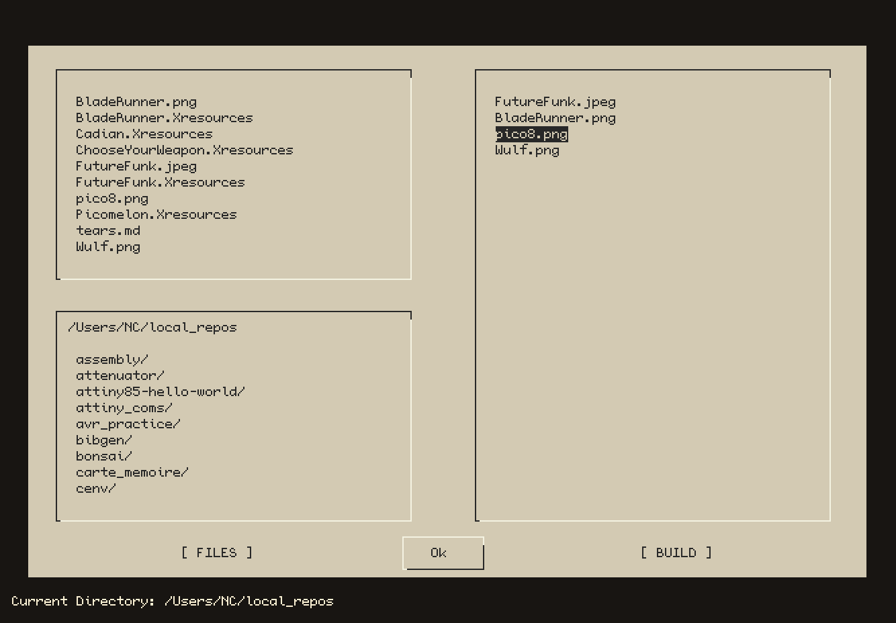

# Fileclaw
### Interactive Python File Selection

<p align="center">

<p/>

---

### Why

```Fileclaw.py``` is a simple ncurses-driven script that allows for easy filelist building 
in the python shell without leaving the terminal or using a native dialog. While other 
packages, such as PyDialog, can also perform this functionality, ```Fileclaw.py``` allows for
custom filelist building for multiple files and file extension filtering. Some may consider this redundant, but
I have never quite found another ncurses-based package that accomplishes these things 
exactly how I want.

### How

```
>>> from fileclaw import *
>>> filelist = fileclaw()
>>> print(filelist)
[file1,file2,file3,...]
```

Navigate between windows using ```TAB```, select files using ```ENTER```, remove files 
from the buildlist using ```d```, change directories using ```c```,
 and set the extension filter using ```s```.

### Dependencies

PyCurses
